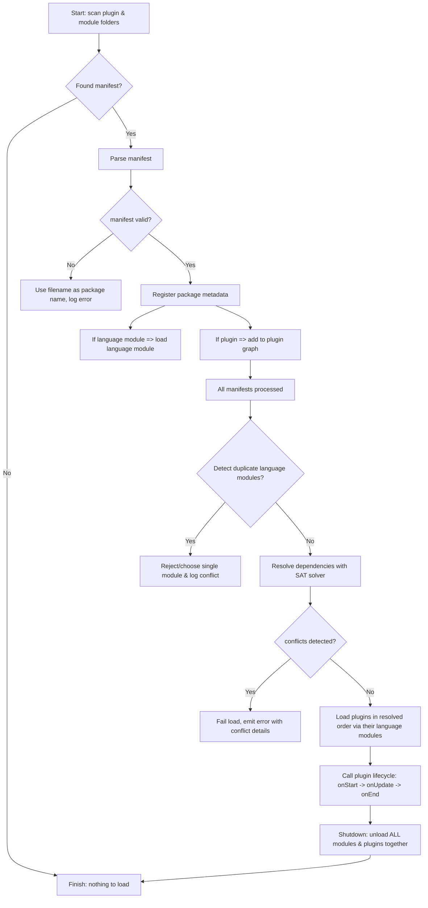
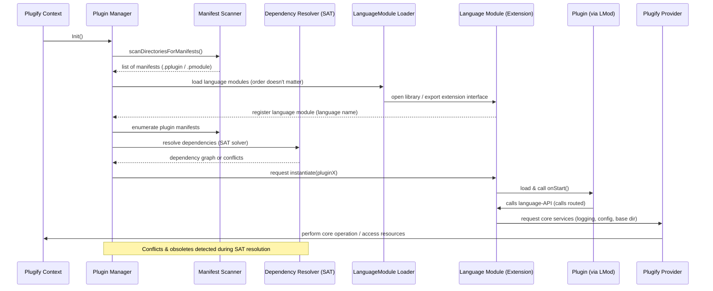
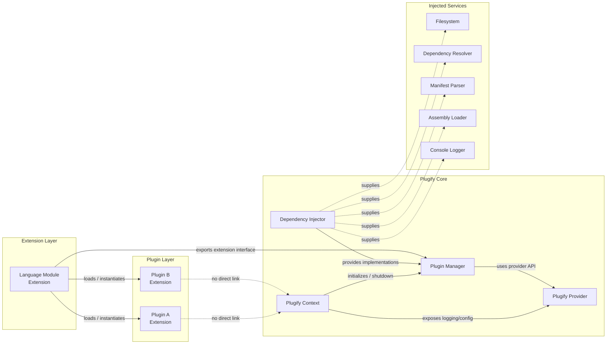

# Plugify 2.0 Architecture

Plugify 2.0 represents a significant architectural evolution, focusing on modularity, extensibility, and performance. The core has been streamlined to concentrate exclusively on plugin management, while introducing powerful new features like dependency injection, SAT-based dependency resolution, and unified extension handling.

## Upgrading from Version 1.x

Plugify 2.0 is a major architectural redesign with breaking changes. If you're upgrading from Version 1.x, here are the key differences:

**Core Changes:**
- **No Package Manager**: Package management has been removed from the core library. Plugify 2.0 focuses exclusively on plugin management, eliminating dependencies on CURL, WinHttp, miniz, and related libraries. Package management is now handled externally.
- **Unified Extension Model**: Plugins and language modules have been merged into a single **Extension** class, simplifying the architecture.
- **SAT Solver**: Dependency resolution now uses [libsolv](https://github.com/openSUSE/libsolv) with a SAT solver instead of DFS, providing sophisticated conflict detection, version constraints, and obsolescence support.
- **PIMPL Pattern**: Core components now use PIMPL (Pointer to Implementation) with exported classes instead of abstract interfaces for better ABI stability.

**New Features:**
- **Dependency Injection**: Service locator pattern allows custom implementations of filesystem, resolver, parser, loader, and logger components.
- **Class Wrappers**: Support for OOP-style class wrappers with constructors and destructors for language modules.
- **Extended Platform Support**: Added ARM32 and x86 to existing x64 and ARM64 support.
- **C++23 Support**: Core uses `std::expected` for error handling while maintaining C++20 compatibility.
- **Enhanced Debugging**: LLDB scripts, Visual Studio visualizers, and full sanitizer support.
- **Thread Safety**: Comprehensive thread safety improvements across all components.
- **Parallel Loading**: Pipeline supports parallel loading with granular failure tracking.

**Note**: Version 1.x is no longer maintained. All new projects should use Plugify 2.0.

---

## Architecture Diagrams

### Extension Loading Pipeline


### Component Interaction Sequence


### Core Architecture Overview


---

## Core Architecture Principles

Plugify is designed to facilitate seamless interaction between language modules, with all components now unified under the **Extension** concept. The core does not communicate directly with plugins; instead, all interactions occur through language module extensions. This modular design extends even to C++ itself, which requires a dedicated language module extension for handling C++-based plugins.

The primary objective is establishing a universal environment that enables fast and efficient inter-language interaction while maintaining clean separation of concerns and allowing unprecedented customization through dependency injection.

### Design Philosophy

**Unified Extension Model**: Plugins and language modules share identical core functionality with only minor behavioral differences. By unifying them into a single Extension class, we eliminate code duplication and simplify the architecture.

**Focused Core**: By removing package management from the core, Plugify concentrates exclusively on what it does best—loading, managing, and orchestrating plugins. This reduces the dependency footprint and makes the core more embeddable in diverse environments.

**Sophisticated Dependency Management**: The [libsolv](https://github.com/openSUSE/libsolv) SAT solver provides industrial-strength dependency resolution used by major Linux distributions. It handles complex version constraints, conflicts, and obsolescence scenarios that simple DFS approaches cannot.

**Extensibility First**: The dependency injection architecture means nearly every aspect of Plugify's behavior can be customized. From how files are accessed to how dependencies are resolved, integrators have full control.

---

## Core Components

### Plugify Context
The Context is responsible for initializing and terminating the Plugify system. It provides:
- System initialization and shutdown orchestration
- Logging infrastructure
- Access to system components
- Configuration information management
- Management of the dependency injection container

The Context serves as the entry point for all Plugify operations and coordinates the lifecycle of all other components.

### Plugify Provider
The Provider offers core functionality to language module extensions:
- Structured logging support with multiple severity levels
- Access to base directories and configuration paths
- Mechanisms for detecting and locating extensions
- Resource management utilities
- Cross-language communication infrastructure

Language modules interact with the Provider to access core services without directly depending on implementation details.

### Plugin Manager
The Plugin Manager oversees the complete lifecycle of extensions:

**Discovery**: Scans designated directories for manifest files and validates them against schemas.

**Loading**: Loads language modules first (order-independent), then resolves plugin dependencies using the SAT solver and loads them in the computed order.

**Lifecycle Management**: Orchestrates the `onStart()`, `onUpdate()`, and `onEnd()` lifecycle calls for all plugins.

**Parallel Pipeline**: The manager includes a sophisticated loading pipeline that:
- Loads independent plugins in parallel when dependencies allow
- Tracks failures with complete dependency chain reporting
- Ensures thread-safe operations throughout the loading process
- Provides detailed diagnostics for troubleshooting

**Graceful Shutdown**: Ensures all plugins and language modules are unloaded together to prevent dependency-related crashes.

### Dependency Injector
A new service locator component that manages customizable implementations of core services. The injector allows you to replace default implementations with custom versions:

- **Filesystem Operations**: Virtual filesystems, network storage, sandboxed environments
- **Dependency Resolver**: Alternative resolution strategies or custom constraint handling
- **Manifest Parser**: Custom manifest formats or enhanced validation
- **Assembly Loader**: Control over native library loading and symbol resolution
- **Console Logger**: Integration with existing logging infrastructure

This makes Plugify adaptable to embedded systems, game engines, containerized environments, or any context requiring fine-grained control.

---

## Extension System

Extensions are the fundamental building blocks in Plugify 2.0, replacing the previous separate concepts of plugins and language modules. An extension can function as either a language module or a plugin—the distinction is operational rather than structural.

### Manifest Files

Extensions contain manifest files that describe their capabilities and requirements:

- **Plugin Manifests** (`.pplugin`): Define user plugins with exported methods, dependencies, and metadata
- **Language Module Manifests** (`.pmodule`): Define language runtime modules that load and manage plugins

Manifest files are formatted in JSON and provide essential metadata:

**Core Metadata**:
- Package name (derived from filename)
- Friendly display name
- Version information (semantic versioning)
- Language specification
- Author and license information

**Functional Metadata**:
- Exported methods with signatures
- Imported methods from dependencies
- Class definitions (for OOP wrappers)
- Unique entry points

**Dependency Specifications**:
- Required dependencies with version constraints (e.g., `>=1.2.0, <2.0.0`)
- Optional dependencies
- Conflict declarations (`conflicts: ["incompatible-plugin"]`)
- Obsolescence specifications (`obsoletes: ["old-plugin-name"]`)

The dual naming system (filename-derived package name + friendly name) ensures robust error reporting even when manifests contain errors.

### Manifest Validation

Manifests must strictly adhere to predefined JSON schemas. The manifest parser:
- Validates structure and required fields
- Checks semantic correctness of version specifications
- Verifies method signature formats
- Ensures unique identifiers
- Reports detailed validation errors with line numbers and specific issues

Invalid manifests are logged with complete diagnostic information, making debugging straightforward.

---

## Extension Implementation

### Development Interface

Plugify 2.0 uses the **PIMPL (Pointer to Implementation) pattern with exported classes** instead of traditional abstract interfaces. This modern approach provides:

**ABI Stability**: Changes to implementation details don't break binary compatibility, allowing core updates without recompiling extensions.

**Reduced Header Dependencies**: Extension developers include minimal headers, speeding up compilation.

**Clear Separation**: Interface and implementation are cleanly separated, making the codebase easier to maintain and evolve.

**Better Tooling Support**: Debuggers and profilers work more effectively with concrete classes.

### Language and Compiler Requirements

Extensions should be compiled with compatible C++ versions:

**Supported Standards**: Both C++20 and C++23 are fully supported
**Error Handling**: The core uses `std::expected` throughout for explicit, type-safe error handling
**Compiler Compatibility**: While same-compiler builds are ideal, the PIMPL pattern provides resilience across version differences

### Memory Safety

To prevent crashes and undefined behavior:

**Consistent Allocators**: Use matching memory allocators between core and extensions. Plugify detects allocator mismatches and issues warnings.

**Debug vs Release**: Different allocator configurations are detected at runtime. Plugify can reject mismatched builds to prevent subtle bugs.

**Clear Ownership**: Return values use value semantics; references indicate borrowed data. This explicit ownership model prevents memory leaks and double-frees.

### Class Wrapper Generation

A major new feature in Plugify 2.0 is support for **class wrappers** in language modules. This enables object-oriented API design:

**OOP Method Grouping**: Related functions can be grouped into logical classes
**Constructor/Destructor Support**: Automatic resource acquisition and cleanup
**Natural Language Mapping**: Languages like C#, Java, and Python can expose more idiomatic APIs
**State Encapsulation**: Objects can maintain internal state across method calls

Example use case: A "Database" class wrapper with methods like `connect()`, `query()`, `close()` provides a cleaner API than separate `db_connect()`, `db_query()`, `db_close()` functions.

Language modules generate these wrappers dynamically, handling the marshaling between the OOP surface and the underlying C function pointers.

---

## Extension Loading Process

### Phase 1: Discovery and Validation

The Plugin Manager scans designated folders for manifest files:

1. **Recursive Scanning**: Searches plugin and module directories
2. **File Identification**: Locates `.pplugin` and `.pmodule` files
3. **Parsing**: Loads and parses JSON manifests
4. **Schema Validation**: Validates against strict JSON schemas
5. **Error Reporting**: Logs detailed errors for invalid manifests

### Phase 2: Language Module Loading

Language modules (extensions) load first:

**Order Independence**: Since language modules don't depend on each other, load order doesn't matter
**Unique Language Names**: Each module is identified by its `language` parameter (e.g., "cpp", "python", "csharp")
**Conflict Prevention**: Only one module per language can be loaded at a time
**Registration**: Modules register themselves with the Plugin Manager for plugin instantiation

Common language modules include:
- C++ module (for native plugins)
- Python module (for Python-based plugins)
- C# module (for .NET plugins)
- Lua module (for Lua scripting)
- JavaScript module (for V8/Node.js plugins)
- Rust module (for Rust plugins)
- D module (for D plugins)

### Phase 3: Dependency Resolution

Before loading plugins, the **libsolv SAT solver** analyzes dependencies:

**Constraint Collection**: Gathers all version requirements, conflicts, and obsolescence declarations from manifests

**Satisfiability Analysis**: Determines if a valid loading order exists that satisfies all constraints

**Conflict Detection**: Identifies impossible combinations:
- Two plugins requiring incompatible versions of the same dependency
- Circular dependencies (though rare with proper design)
- Missing required dependencies
- Conflicting plugins that cannot coexist

**Version Selection**: When multiple versions could satisfy constraints, selects optimal versions based on:
- Most recent compatible versions
- Minimal dependency graph complexity
- User-specified preferences (if provided)

**Obsolescence Handling**: Automatically handles situations where newer packages replace older ones

**Error Reporting**: When resolution fails, provides detailed explanation:
- Which constraints conflict
- Dependency chains leading to conflicts
- Suggestions for resolution (e.g., "Plugin A requires B>=2.0, but Plugin C requires B<2.0")

The SAT solver approach is dramatically more sophisticated than simple DFS, handling scenarios that would be impossible with simpler algorithms.

### Phase 4: Plugin Loading (Parallel Pipeline)

Once dependencies are resolved, the loading pipeline executes:

**Dependency Ordering**: Plugins are grouped into "waves" based on dependency depth
- Wave 0: Plugins with no dependencies
- Wave 1: Plugins depending only on Wave 0
- Wave N: Plugins depending on earlier waves

**Parallel Execution**: Within each wave, plugins load in parallel, maximizing CPU utilization

**Progress Tracking**: Each plugin's load state is tracked:
- Pending
- Loading
- Loaded
- Failed (with detailed error information)

**Failure Handling**: When a plugin fails to load:
- The failure is logged with complete diagnostic information
- Dependent plugins are automatically marked as failed (cascade)
- The dependency chain leading to the failure is reported
- Loading continues for independent plugins

**Thread Safety**: All operations are protected by appropriate synchronization, allowing safe concurrent access

### Phase 5: Lifecycle Management

After successful loading, each plugin's lifecycle functions are invoked:

**onStart()**: Initialization phase
- Plugin initializes internal state
- Registers services with other plugins
- Sets up resources
- Called in dependency order (dependencies start first)

**onUpdate()**: Runtime phase
- Called periodically or on-demand
- Plugin performs its work
- Can interact with other plugins
- Frequency determined by application needs

**onEnd()**: Cleanup phase
- Plugin releases resources
- Unregisters services
- Saves state if needed
- Called in reverse dependency order (dependencies end last)

### Unloadable Runtime Constraints

Some language modules cannot be unloaded after initialization:

**.NET Modules**: The .NET runtime [cannot be unloaded](https://github.com/dotnet/runtime/issues/70229) once initialized. Attempting to do so causes crashes related to garbage collector state.

**Go Modules**: The Go runtime [does not support unloading](https://github.com/golang/go/issues/32497). The garbage collector and scheduler cannot be safely torn down.

Plugify handles these constraints gracefully:
- Tracks which modules are unloadable
- Ensures proper shutdown sequence
- Prevents attempts to unload unsafe modules
- Documents these limitations in language module specifications

---

## Platform Support

Plugify 2.0 dramatically expands platform and architecture support:

### Supported Architectures

**x64 (x86-64/AMD64)**:
- Windows (Vista and later)
- Linux (kernel 2.6+)
- macOS (10.9+)

**ARM64 (AArch64)**:
- Linux (ARM64)
- macOS (Apple Silicon)
- Android (ARM64)
- Windows (ARM64)

**ARM32 (ARM)** *(new in 2.0)*:
- Linux (ARMv7+)
- Android (ARMv7+)
- Embedded systems

**x86 (IA-32)** *(new in 2.0)*:
- Windows (XP and later)
- Linux (i686+)
- Legacy systems

This comprehensive architecture support enables Plugify to run on:
- High-performance servers and workstations
- Consumer desktops and laptops
- Mobile devices (Android, iOS via ARM64)
- Embedded systems and IoT devices
- Legacy and specialized hardware

### Calling Conventions

Plugify uses platform-specific [C calling conventions](https://en.wikipedia.org/wiki/X86_calling_conventions):

- **x64**: System V AMD64 ABI (Linux/macOS), Microsoft x64 (Windows)
- **ARM64**: AAPCS64 (all platforms)
- **ARM32**: AAPCS (all platforms)
- **x86**: cdecl, stdcall (platform-dependent)

These conventions ensure broad compatibility with embedded languages and native code.

---

## Versioning

Plugify strictly adheres to [Semantic Versioning 2.0](https://semver.org/):

### Version Format: MAJOR.MINOR.PATCH

**MAJOR**: Breaking changes
- Incompatible API changes
- Removal of deprecated features
- Architectural changes requiring code updates

**MINOR**: Backward-compatible additions
- New features
- New APIs
- Enhanced functionality
- Performance improvements

**PATCH**: Backward-compatible fixes
- Bug fixes
- Security patches
- Documentation updates
- Internal refactoring

### Extension Versioning Best Practices

**For Extension Developers**:
- Increment MAJOR for breaking changes to exported APIs
- Increment MINOR when adding new exported methods or features
- Increment PATCH for bug fixes that don't change APIs

**For Dependency Declarations**:
- Use version ranges: `>=1.2.0, <2.0.0` (allows 1.x updates, blocks 2.x)
- Pin exact versions only when necessary: `=1.2.3`
- Use `~` for patch updates: `~1.2.0` (allows 1.2.x, blocks 1.3.0)
- Use `^` for minor updates: `^1.2.0` (allows 1.x, blocks 2.0.0)

The SAT solver understands and enforces these versioning semantics, ensuring compatibility constraints are properly respected during dependency resolution.

---

## Communication Mechanism

Plugify's inter-plugin communication is designed for maximum performance and compatibility.

### Function Pointers and Calling Conventions

Communication between plugins uses [C function pointers](https://en.wikipedia.org/wiki/Function_pointer) with the appropriate platform calling convention. This approach:

- Eliminates marshaling overhead for C++ plugins
- Provides predictable performance characteristics
- Supports all major processor architectures
- Maintains compatibility with embedded language FFI systems

### Type System

Plugify supports a comprehensive set of parameter types:

**Primitive Types**:
- All standard C integer types (`int8_t` through `int64_t`, `uint8_t` through `uint64_t`)
- Floating-point types (`float`, `double`)
- Boolean (`bool`)
- Pointers and references

**Container Types**:
- String (`plg::string`)
- Vectors (`plg::vector`)
- Variant types for dynamic typing (`plg::variant`)

**Structure Types**:
- Plain Old Data (POD) structures (`plg::vec2`, `plg::vec3`, `plg::vec4`, etc.)
- Passed by reference for calling convention simplicity

**Class Instances** *(new in 2.0)*:
- OOP objects with methods
- Handled through opaque pointers with wrapper APIs

### Passing Semantics

**Pass by Reference**: Complex types (strings, vectors, objects) are passed as C++ objects by reference to avoid unnecessary copies and simplify calling convention compliance.

**Pass by Value**: Return values always use value semantics to ensure clear ownership and prevent memory leaks.

**Memory Management**: Each language module is responsible for managing memory allocated in its domain. Clear ownership rules prevent leaks and double-frees.

### Function Marshaling

Language modules may dynamically generate marshaling code at runtime:

**Static Languages (C++, Rust)**: No marshaling needed—direct function calls at native speed

**Managed Languages (C#, Go)**: The [AsmJit](https://asmjit.com/) library generates trampolines that:
- Marshal parameters from managed to native representations
- Invoke the native function
- Marshal the return value back to managed form

**Dynamic Languages (Python, Lua, Js)**: Similar marshaling with additional type checking and conversion

**Performance Impact**:
- C++ to C++: Zero overhead (direct calls)
- C++ to/from managed: Small overhead (microseconds per call)
- Managed to managed: Two marshaling steps if going through C++

For performance-critical paths, consider keeping hot loops within a single language or using batch APIs to amortize marshaling costs.

### Type Safety

Function signatures are strictly defined in manifests:

**No Variadic Parameters**: All parameters must be explicitly declared
**Type Checking**: Language modules verify types at load time and call time
**Version Compatibility**: Signature changes require version increments
**Alternative Solutions**: For flexible parameters, use variant types or structure pointers

This strict typing prevents crashes, memory corruption, and hard-to-debug issues when plugins interact.

---

## Development and Debugging

### Debugging Infrastructure

Plugify 2.0 includes comprehensive debugging support:

**LLDB Integration**:
- Custom type summaries for PLG types
- Python scripts for data visualization
- Pretty-printers for complex structures
- Installation: Copy scripts to `~/.lldb/` or load dynamically

**Visual Studio Integration**:
- NatVis visualizers for PLG types
- Detailed structure inspection in watch windows
- Custom expansion for containers and smart pointers
- Installation: Place `.natvis` files in project or VS directory

**GDB Support**:
- Python pretty-printers for core types
- Helpful command aliases
- Type introspection helpers

These tools make debugging multi-language plugin interactions significantly easier by providing meaningful representations of Plugify's internal data structures.

### Sanitizer Support

Full support for modern sanitizers helps catch bugs during development:

**AddressSanitizer (ASan)**:
- Detects memory leaks, buffer overflows, use-after-free
- Catches heap, stack, and global buffer overflows
- Reports detailed error information with stack traces

**UndefinedBehaviorSanitizer (UBSan)**:
- Detects undefined behavior at runtime
- Catches null pointer dereferences, integer overflows, invalid casts
- Helps ensure code portability and correctness

**ThreadSanitizer (TSan)**:
- Detects data races and threading issues
- Reports conflicting accesses to shared memory
- Helps ensure thread-safe plugin interactions

**MemorySanitizer (MSan)**:
- Detects reads of uninitialized memory
- Catches subtle bugs that other tools miss

**Usage**: Enable sanitizers through CMake build options:
```bash
cmake -DCMAKE_BUILD_TYPE=Debug -DENABLE_ASAN=ON ..
```

Language modules compiled with the same sanitizers as the core can detect issues across the language boundary.

### Thread Safety

Plugify 2.0 is designed for thread-safe operation:

**Public API Thread Safety**: All public APIs are thread-safe by default. Multiple threads can safely call Plugify functions simultaneously.

**Internal Synchronization**: Appropriate mutexes, atomics, and lock-free structures protect shared state.

**Loading Pipeline**: The parallel loading system is fully thread-safe, allowing concurrent plugin initialization.

**Documentation**: Each API function documents its thread-safety guarantees and any special considerations.

**Best Practices for Extension Developers**:
- Protect shared plugin state with mutexes
- Use thread-local storage for per-thread state
- Be aware that callbacks may occur on different threads
- Follow thread-safety guidelines in your chosen language

---

## Integration and Extensibility

### Dependency Injection in Practice

The dependency injection system is the cornerstone of Plugify 2.0's flexibility. Here's how integrators can customize each component:

**Custom Filesystem**:
```cpp
// Provide a virtual filesystem implementation
class VirtualFilesystem : public IFileSystem {
    // Implement file operations for virtual storage
};

plugifyBuilder.Registry(std::make_unique<VirtualFilesystem>());
```

Use cases:
- Virtual filesystems for sandboxed environments
- Network-mounted storage
- Encrypted filesystems
- In-memory filesystems for testing

**Custom Dependency Resolver**:
```cpp
// Provide alternative resolution strategy
class CustomResolver : public IDependencyResolver {
    // Implement resolution algorithm
};

plugifyBuilder.Registry(std::make_unique<CustomResolver>());
```

Use cases:
- Application-specific constraint handling
- Custom conflict resolution policies
- Integration with external package managers
- Testing with mock resolvers

**Custom Manifest Parser**:
```cpp
// Support additional manifest formats
class YamlManifestParser : public IManifestParser {
    // Parse YAML manifests
};

plugifyBuilder.Registry(std::make_unique<YamlManifestParser>());
```

Use cases:
- YAML, TOML, or custom format support
- Enhanced validation rules
- Domain-specific manifest extensions
- Migration from legacy formats

**Custom Logger**:
```cpp
// Integrate with existing logging infrastructure
class CustomLogger : public ILogger {
    void Log(Severity level, std::string_view message) override {
        // Route to existing log system
    }
};

plugifyBuilder.Registry(std::make_unique<CustomLogger>());
```

Use cases:
- Integration with syslog, Windows Event Log, or cloud logging
- Structured logging with JSON formatting
- Log aggregation systems (ELK, Splunk)
- Game engine console integration

### Build System Integration

Plugify integrates seamlessly with modern build systems:

**CMake**:
```cmake
find_package(plugify REQUIRED)
target_link_libraries(my_app PRIVATE plugify::plugify)
```

**Features**:
- Modern CMake targets with proper dependency propagation
- Header-only mode for compile-time integration
- Dynamic and static linking options
- Cross-compilation support for all target architectures
- Optional components (disable features not needed)

**Linking Modes**:
- **Dynamic Linking**: Standard shared library (.so, .dll, .dylib)
- **Static Linking**: Single binary with no external dependencies
- **Object Library**: Link Plugify directly into your executable (useful on Windows for DLL export handling)

**Cross-Compilation**:
```bash
# Example: Build for ARM64 on x64 Linux
cmake -DCMAKE_TOOLCHAIN_FILE=arm64-linux.cmake ..
```

Plugify's build system handles architecture-specific code automatically, ensuring correct calling conventions and assembly generation for each target.

---

## Use Cases and Applications

Plugify 2.0's architecture makes it suitable for a wide range of applications:

### Game Engines
- Mod support with cross-language scripting (Lua, Python, C#)
- Plugin-based rendering backends (Vulkan, DirectX, OpenGL)
- Hot-reloadable game logic during development
- Community-created content with safe sandboxing

### Application Frameworks
- Extensible business applications
- Plugin-based feature sets
- Multi-tenant customization
- Third-party integration support

### Development Tools
- Language servers with plugin analyzers
- Build system extensions
- IDE plugins with native performance
- Code generation tools

### Embedded Systems
- Modular firmware architecture
- Loadable device drivers
- Field-upgradeable functionality
- Resource-constrained environments (with custom allocators)

### Server Applications
- Microservice plugin architecture
- Hot-swappable request handlers
- Multi-language business logic
- Performance-critical path in C++, auxiliary features in scripting languages

---

## Performance Considerations

### Zero-Cost Abstractions

Plugify is designed around C++'s "zero-cost abstraction" principle:

- **C++ to C++ calls**: Direct function pointers with no overhead
- **PIMPL pattern**: Minimal indirection, optimized by compiler
- **std::expected**: No exception overhead, predictable performance
- **Dependency injection**: Resolved at startup, no runtime cost

### Optimization Opportunities

**Parallel Loading**: The parallel pipeline can significantly reduce startup time for large plugin sets.

**Lazy Loading**: Consider implementing lazy initialization for plugins not needed at startup.

**Batch APIs**: For performance-critical cross-language calls, design APIs that operate on batches rather than individual items.

**Memory Pools**: Language modules can implement custom allocators for frequently allocated types.

### Profiling

Plugify works well with standard profiling tools:
- CPU profilers (perf, VTune, Instruments)
- Memory profilers (Valgrind, HeapTrack)
- System tracers (strace, DTrace)

The debugging infrastructure makes it easy to identify hot spots and optimize performance-critical paths.

---

## Security Considerations

### Sandboxing

While Plugify doesn't provide built-in sandboxing, the dependency injection architecture makes it straightforward to implement:

**Filesystem Sandboxing**: Inject a restricted filesystem that limits access to specific directories.

**Network Isolation**: Control plugin network access through custom I/O implementations.

**Resource Limits**: Implement wrappers that enforce memory, CPU, or I/O quotas.

### Input Validation

Extension developers should:
- Validate all inputs from other plugins
- Use safe string handling functions
- Check array bounds explicitly
- Handle errors gracefully with `std::expected`

### Memory Safety

The architecture helps prevent common vulnerabilities:
- No use-after-free (clear ownership semantics)
- No buffer overflows (bounds-checked containers)
- No double-free (RAII and smart pointers)
- Sanitizers catch remaining issues during development

---

## Conclusion

Plugify 2.0 represents a mature, production-ready plugin system designed for flexibility, performance, and developer experience. The architectural improvements address real-world needs:

**For integrators**: Dependency injection provides unprecedented customization without forking the codebase.

**For plugin developers**: Unified extensions, clear documentation, excellent debugging support, and sophisticated dependency management simplify development.

**For end users**: Robust conflict detection, parallel loading, and comprehensive error reporting ensure a smooth experience.

Whether you're building a modding framework, an extensible application, or a complex multi-language system, Plugify 2.0 provides the foundation for reliable, efficient plugin management. The focus on modern C++ practices (PIMPL, `std::expected`, thread safety) ensures the codebase will remain maintainable and performant for years to come.

Get started with Plugify 2.0 today and experience the power of truly flexible, cross-language plugin architecture.
