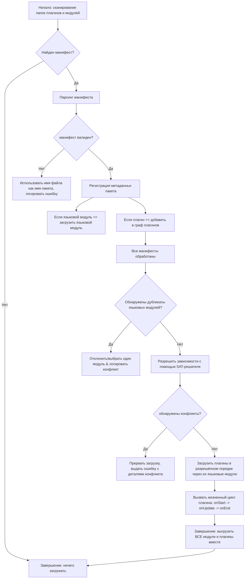
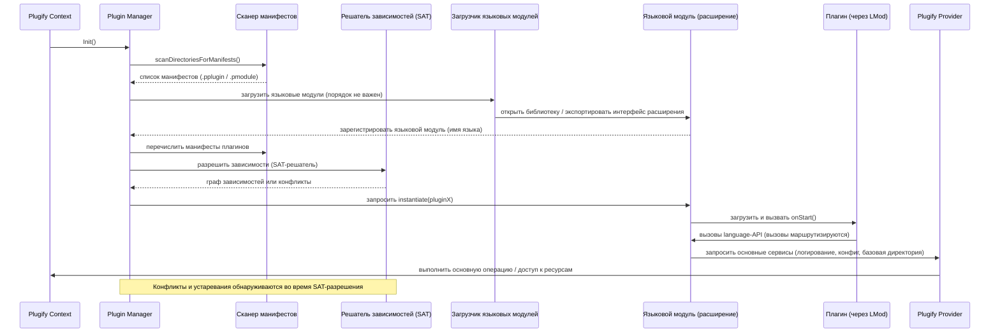
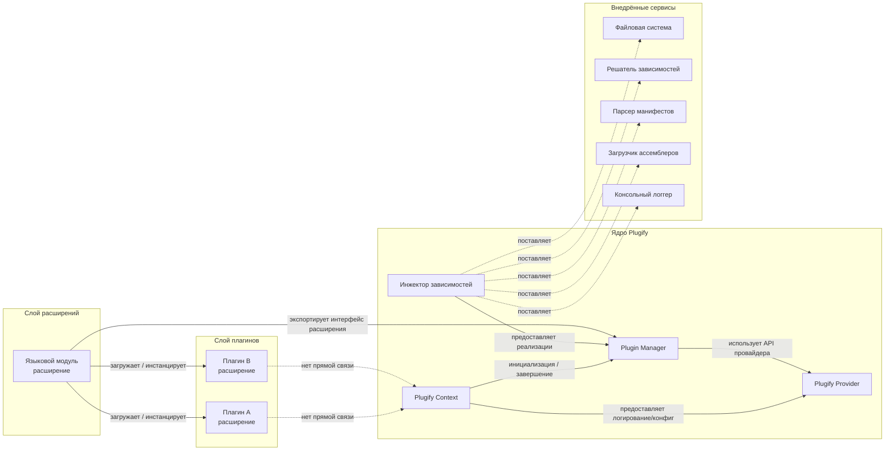

# Архитектура Plugify 2.0

Plugify 2.0 представляет собой значительную эволюцию архитектуры, с упором на модульность, расширяемость и производительность. Ядро было оптимизировано для концентрации исключительно на управлении плагинами, при этом появились мощные новые возможности, такие как внедрение зависимостей, разрешение зависимостей на основе SAT и унифицированная обработка расширений.

## Обновление с версии 1.x

Plugify 2.0 — это крупная переработка архитектуры с критическими изменениями. Если вы обновляетесь с версии 1.x, вот ключевые отличия:

**Основные изменения:**
- **Нет менеджера пакетов**: Управление пакетами было удалено из основной библиотеки. Plugify 2.0 фокусируется исключительно на управлении плагинами, устраняя зависимости от CURL, WinHttp, miniz и связанных библиотек. Управление пакетами теперь осуществляется внешними средствами.
- **Унифицированная модель расширений**: Плагины и языковые модули объединены в единый класс **Extension**, упрощающий архитектуру.
- **SAT-решатель**: Разрешение зависимостей теперь использует [libsolv](https://github.com/openSUSE/libsolv) с SAT-решателем вместо DFS, обеспечивая сложное обнаружение конфликтов, версионные ограничения и поддержку устаревания.
- **Паттерн PIMPL**: Основные компоненты теперь используют PIMPL (Pointer to Implementation) с экспортированными классами вместо абстрактных интерфейсов для лучшей стабильности ABI.

**Новые возможности:**
- **Внедрение зависимостей**: Паттерн Service Locator позволяет использовать пользовательские реализации файловой системы, решателя зависимостей, парсера, загрузчика и компонентов логирования.
- **Обёртки классов**: Поддержка обёрток классов в стиле ООП с конструкторами и деструкторами для языковых модулей.
- **Расширенная поддержка платформ**: Добавлены ARM32 и x86 к существующим x64 и ARM64.
- **Поддержка C++23**: Ядро использует `std::expected` для обработки ошибок, сохраняя совместимость с C++20.
- **Улучшенная отладка**: Скрипты LLDB, визуализаторы Visual Studio и полная поддержка санитайзеров.
- **Потокобезопасность**: Комплексные улучшения потокобезопасности во всех компонентах.
- **Параллельная загрузка**: Конвейер поддерживает параллельную загрузку с детальным отслеживанием сбоев.

**Примечание**: Версия 1.x больше не поддерживается. Все новые проекты должны использовать Plugify 2.0.

---

## Диаграммы архитектуры

### Конвейер загрузки расширений


### Последовательность взаимодействия компонентов


### Обзор архитектуры ядра


---

## Основные принципы архитектуры

Plugify разработан для обеспечения бесшовного взаимодействия между языковыми модулями, при этом все компоненты теперь унифицированы под концепцией **Extension** (расширение). Ядро не взаимодействует напрямую с плагинами; вместо этого все взаимодействия происходят через расширения языковых модулей. Эта модульная архитектура распространяется даже на сам C++, который требует специального расширения языкового модуля для обработки плагинов на C++.

Основная цель — создание универсальной среды, которая обеспечивает быстрое и эффективное межъязыковое взаимодействие при сохранении чёткого разделения ответственности и предоставлении беспрецедентных возможностей настройки через внедрение зависимостей.

### Философия проектирования

**Унифицированная модель расширений**: Плагины и языковые модули имеют идентичную основную функциональность с незначительными поведенческими различиями. Объединяя их в единый класс Extension, мы устраняем дублирование кода и упрощаем архитектуру.

**Сфокусированное ядро**: Удалив управление пакетами из ядра, Plugify концентрируется исключительно на том, что делает лучше всего — загрузке, управлении и оркестрации плагинов. Это уменьшает зависимости и делает ядро более встраиваемым в различные среды.

**Сложное управление зависимостями**: SAT-решатель [libsolv](https://github.com/openSUSE/libsolv) обеспечивает промышленное разрешение зависимостей, используемое основными дистрибутивами Linux. Он обрабатывает сложные версионные ограничения, конфликты и сценарии устаревания, которые простые подходы DFS не могут.

**Расширяемость прежде всего**: Архитектура внедрения зависимостей означает, что практически любой аспект поведения Plugify может быть настроен. От того, как осуществляется доступ к файлам, до того, как разрешаются зависимости, интеграторы имеют полный контроль.

---

## Основные компоненты

### Plugify Context
Context отвечает за инициализацию и завершение работы системы Plugify. Он предоставляет:
- Оркестрацию инициализации и завершения системы
- Инфраструктуру логирования
- Доступ к системным компонентам
- Управление конфигурационной информацией
- Управление контейнером внедрения зависимостей

Context служит точкой входа для всех операций Plugify и координирует жизненный цикл всех других компонентов.

### Plugify Provider
Provider предлагает основную функциональность для расширений языковых модулей:
- Структурированная поддержка логирования с несколькими уровнями серьезности
- Доступ к базовым директориям и путям конфигурации
- Механизмы для обнаружения и локализации расширений
- Утилиты управления ресурсами
- Инфраструктура межъязыковой коммуникации

Языковые модули взаимодействуют с Provider для доступа к основным сервисам без прямой зависимости от деталей реализации.

### Plugin Manager
Plugin Manager управляет полным жизненным циклом расширений:

**Обнаружение**: Сканирует указанные директории на наличие файлов манифестов и проверяет их на соответствие схемам.

**Загрузка**: Сначала загружает языковые модули (порядок не важен), затем разрешает зависимости плагинов с помощью SAT-решателя и загружает их в вычисленном порядке.

**Управление жизненным циклом**: Оркеструет вызовы `onStart()`, `onUpdate()` и `onEnd()` жизненного цикла для всех плагинов.

**Параллельный конвейер**: Менеджер включает сложный конвейер загрузки, который:
- Загружает независимые плагины параллельно, когда это позволяют зависимости
- Отслеживает сбои с полным отчётом о цепочке зависимостей
- Обеспечивает потокобезопасные операции на протяжении всего процесса загрузки
- Предоставляет подробную диагностику для устранения неполадок

**Корректное завершение**: Обеспечивает, что все плагины и языковые модули выгружаются вместе для предотвращения сбоев, связанных с зависимостями.

### Dependency Injector
Новый компонент Service Locator, который управляет настраиваемыми реализациями основных сервисов. Инжектор позволяет заменять стандартные реализации на пользовательские версии:

- **Операции файловой системы**: Виртуальные файловые системы, сетевое хранилище, изолированные среды
- **Решатель зависимостей**: Альтернативные стратегии разрешения или пользовательская обработка ограничений
- **Парсер манифестов**: Пользовательские форматы манифестов или расширенная валидация
- **Загрузчик ассемблеров**: Контроль загрузки нативных библиотек и разрешения символов
- **Консольный логгер**: Интеграция с существующей инфраструктурой логирования

Это делает Plugify адаптируемым к встроенным системам, игровым движкам, контейнеризованным средам или любому контексту, требующему детального контроля.

---

## Система расширений

Расширения — это фундаментальные строительные блоки в Plugify 2.0, заменяющие предыдущие отдельные концепции плагинов и языковых модулей. Расширение может функционировать как языковой модуль или как плагин — различие является операционным, а не структурным.

### Файлы манифестов

Расширения содержат файлы манифестов, описывающие их возможности и требования:

- **Манифесты плагинов** (`.pplugin`): Определяют пользовательские плагины с экспортированными методами, зависимостями и метаданными
- **Манифесты языковых модулей** (`.pmodule`): Определяют модули языковой среды выполнения, которые загружают и управляют плагинами

Файлы манифестов отформатированы в JSON и предоставляют основные метаданные:

**Основные метаданные**:
- Имя пакета (производное от имени файла)
- Дружественное отображаемое имя
- Информация о версии (семантическое версионирование)
- Спецификация языка
- Информация об авторе и лицензии

**Функциональные метаданные**:
- Экспортированные методы с сигнатурами
- Импортированные методы из зависимостей
- Определения классов (для OOP-обёрток)
- Уникальные точки входа

**Спецификации зависимостей**:
- Обязательные зависимости с версионными ограничениями (например, `>=1.2.0, <2.0.0`)
- Опциональные зависимости
- Объявления конфликтов (`conflicts: ["incompatible-plugin"]`)
- Спецификации устаревания (`obsoletes: ["old-plugin-name"]`)

Система двойного именования (имя пакета, производное от имени файла + дружественное имя) обеспечивает надёжное сообщение об ошибках даже когда манифесты содержат ошибки.

### Валидация манифестов

Манифесты должны строго соответствовать предопределённым JSON-схемам. Парсер манифестов:
- Проверяет структуру и обязательные поля
- Проверяет семантическую корректность версионных спецификаций
- Проверяет форматы сигнатур методов
- Обеспечивает уникальность идентификаторов
- Сообщает о подробных ошибках валидации с номерами строк и конкретными проблемами

Невалидные манифесты логируются с полной диагностической информацией, что упрощает отладку.

---

## Реализация расширений

### Интерфейс разработки

Plugify 2.0 использует **паттерн PIMPL (Pointer to Implementation) с экспортированными классами** вместо традиционных абстрактных интерфейсов. Этот современный подход обеспечивает:

**Стабильность ABI**: Изменения в деталях реализации не нарушают бинарную совместимость, позволяя обновлять ядро без перекомпиляции расширений.

**Сокращённые зависимости заголовков**: Разработчики расширений включают минимальное количество заголовков, ускоряя компиляцию.

**Чёткое разделение**: Интерфейс и реализация чётко разделены, что упрощает поддержку и развитие кодовой базы.

**Лучшая поддержка инструментов**: Отладчики и профилировщики работают более эффективно с конкретными классами.

### Требования к языку и компилятору

Расширения должны быть скомпилированы с совместимыми версиями C++:

**Поддерживаемые стандарты**: Полностью поддерживаются C++20 и C++23
**Обработка ошибок**: Ядро использует `std::expected` повсюду для явной, типобезопасной обработки ошибок
**Совместимость компилятора**: Хотя сборки с одинаковым компилятором идеальны, паттерн PIMPL обеспечивает устойчивость к различиям версий

### Безопасность памяти

Для предотвращения сбоев и неопределённого поведения:

**Согласованные аллокаторы**: Используйте соответствующие аллокаторы памяти между ядром и расширениями. Plugify обнаруживает несоответствия аллокаторов и выдаёт предупреждения.

**Debug vs Release**: Различные конфигурации аллокаторов обнаруживаются во время выполнения. Plugify может отклонять несовпадающие сборки для предотвращения тонких ошибок.

**Чёткое владение**: Возвращаемые значения используют семантику значений; ссылки указывают на заимствованные данные. Эта явная модель владения предотвращает утечки памяти и двойные освобождения.

### Генерация обёрток классов

Основная новая возможность в Plugify 2.0 — это поддержка **обёрток классов** в языковых модулях. Это обеспечивает объектно-ориентированное проектирование API:

**Группировка методов ООП**: Связанные функции могут быть сгруппированы в логические классы
**Поддержка конструктора/деструктора**: Автоматическое получение и очистка ресурсов
**Естественное отображение на язык**: Языки, такие как C#, Java и Python, могут предоставлять более идиоматичные API
**Инкапсуляция состояния**: Объекты могут поддерживать внутреннее состояние между вызовами методов

Пример использования: обёртка класса "Database" с методами `connect()`, `query()`, `close()` предоставляет более чистый API, чем отдельные функции `db_connect()`, `db_query()`, `db_close()`.

Языковые модули генерируют эти обёртки динамически, обрабатывая маршалинг между OOP-поверхностью и базовыми указателями на C-функции.

---

## Процесс загрузки расширений

### Фаза 1: Обнаружение и валидация

Plugin Manager сканирует указанные папки на наличие файлов манифестов:

1. **Рекурсивное сканирование**: Поиск в директориях плагинов и модулей
2. **Идентификация файлов**: Поиск файлов `.pplugin` и `.pmodule`
3. **Парсинг**: Загрузка и парсинг JSON-манифестов
4. **Валидация схемы**: Проверка на соответствие строгим JSON-схемам
5. **Отчёт об ошибках**: Логирование подробных ошибок для невалидных манифестов

### Фаза 2: Загрузка языковых модулей

Языковые модули (расширения) загружаются первыми:

**Независимость порядка**: Поскольку языковые модули не зависят друг от друга, порядок загрузки не имеет значения
**Уникальные имена языков**: Каждый модуль идентифицируется по его параметру `language` (например, "cpp", "python", "csharp")
**Предотвращение конфликтов**: Одновременно может быть загружен только один модуль для каждого языка
**Регистрация**: Модули регистрируются в Plugin Manager для инстанцирования плагинов

Распространённые языковые модули включают:
- Модуль C++ (для нативных плагинов)
- Модуль Python (для плагинов на Python)
- Модуль C# (для плагинов .NET)
- Модуль Lua (для скриптов Lua)
- Модуль JavaScript (для плагинов V8/Node.js)
- Модуль Rust (для плагинов Rust)
- Модуль D (для плагинов D)

### Фаза 3: Разрешение зависимостей

Перед загрузкой плагинов **libsolv SAT-решатель** анализирует зависимости:

**Сбор ограничений**: Собирает все версионные требования, конфликты и объявления устаревания из манифестов

**Анализ выполнимости**: Определяет, существует ли валидный порядок загрузки, удовлетворяющий всем ограничениям

**Обнаружение конфликтов**: Идентифицирует невозможные комбинации:
- Два плагина, требующие несовместимые версии одной и той же зависимости
- Циклические зависимости (хотя редки при правильном дизайне)
- Отсутствующие обязательные зависимости
- Конфликтующие плагины, которые не могут сосуществовать

**Выбор версии**: Когда несколько версий могут удовлетворить ограничениям, выбирает оптимальные версии на основе:
- Наиболее свежих совместимых версий
- Минимальной сложности графа зависимостей
- Пользовательских предпочтений (если предоставлены)

**Обработка устаревания**: Автоматически обрабатывает ситуации, когда новые пакеты заменяют старые

**Отчёт об ошибках**: Когда разрешение не удаётся, предоставляет подробное объяснение:
- Какие ограничения конфликтуют
- Цепочки зависимостей, ведущие к конфликтам
- Предложения по разрешению (например, "Плагин A требует B>=2.0, но Плагин C требует B<2.0")

Подход SAT-решателя драматически более сложен, чем простой DFS, обрабатывая сценарии, которые были бы невозможны с более простыми алгоритмами.

### Фаза 4: Загрузка плагинов (параллельный конвейер)

После разрешения зависимостей выполняется конвейер загрузки:

**Упорядочивание зависимостей**: Плагины группируются в "волны" на основе глубины зависимостей
- Волна 0: Плагины без зависимостей
- Волна 1: Плагины, зависящие только от Волны 0
- Волна N: Плагины, зависящие от предыдущих волн

**Параллельное выполнение**: Внутри каждой волны плагины загружаются параллельно, максимизируя использование CPU

**Отслеживание прогресса**: Отслеживается состояние загрузки каждого плагина:
- Ожидание
- Загрузка
- Загружен
- Сбой (с подробной информацией об ошибке)

**Обработка сбоев**: Когда плагин не загружается:
- Сбой логируется с полной диагностической информацией
- Зависимые плагины автоматически помечаются как сбойные (каскад)
- Сообщается цепочка зависимостей, приведшая к сбою
- Загрузка продолжается для независимых плагинов

**Потокобезопасность**: Все операции защищены соответствующей синхронизацией, обеспечивая безопасный конкурентный доступ

### Фаза 5: Управление жизненным циклом

После успешной загрузки вызываются функции жизненного цикла каждого плагина:

**onStart()**: Фаза инициализации
- Плагин инициализирует внутреннее состояние
- Регистрирует сервисы с другими плагинами
- Устанавливает ресурсы
- Вызывается в порядке зависимостей (зависимости стартуют первыми)

**onUpdate()**: Фаза выполнения
- Вызывается периодически или по требованию
- Плагин выполняет свою работу
- Может взаимодействовать с другими плагинами
- Частота определяется потребностями приложения

**onEnd()**: Фаза очистки
- Плагин освобождает ресурсы
- Отменяет регистрацию сервисов
- Сохраняет состояние при необходимости
- Вызывается в обратном порядке зависимостей (зависимости завершаются последними)

### Ограничения выгружаемых сред выполнения

Некоторые языковые модули не могут быть выгружены после инициализации:

**Модули .NET**: Среда выполнения .NET [не может быть выгружена](https://github.com/dotnet/runtime/issues/70229) после инициализации. Попытка сделать это вызывает сбои, связанные с состоянием сборщика мусора.

**Модули Go**: Среда выполнения Go [не поддерживает выгрузку](https://github.com/golang/go/issues/32497). Сборщик мусора и планировщик не могут быть безопасно разобраны.

Plugify корректно обрабатывает эти ограничения:
- Отслеживает, какие модули не могут быть выгружены
- Обеспечивает правильную последовательность завершения
- Предотвращает попытки выгрузить небезопасные модули
- Документирует эти ограничения в спецификациях языковых модулей

---

## Поддержка платформ

Plugify 2.0 драматически расширяет поддержку платформ и архитектур:

### Поддерживаемые архитектуры

**x64 (x86-64/AMD64)**:
- Windows (Vista и новее)
- Linux (ядро 2.6+)
- macOS (10.9+)

**ARM64 (AArch64)**:
- Linux (ARM64)
- macOS (Apple Silicon)
- Android (ARM64)
- Windows (ARM64)

**ARM32 (ARM)** *(новое в 2.0)*:
- Linux (ARMv7+)
- Android (ARMv7+)
- Встроенные системы

**x86 (IA-32)** *(новое в 2.0)*:
- Windows (XP и новее)
- Linux (i686+)
- Устаревшие системы

Эта комплексная поддержка архитектур позволяет Plugify работать на:
- Высокопроизводительных серверах и рабочих станциях
- Потребительских десктопах и ноутбуках
- Мобильных устройствах (Android, iOS через ARM64)
- Встроенных системах и IoT-устройствах
- Устаревшем и специализированном оборудовании

### Соглашения о вызовах

Plugify использует платформенно-специфичные [соглашения о вызовах C](https://en.wikipedia.org/wiki/X86_calling_conventions):

- **x64**: System V AMD64 ABI (Linux/macOS), Microsoft x64 (Windows)
- **ARM64**: AAPCS64 (все платформы)
- **ARM32**: AAPCS (все платформы)
- **x86**: cdecl, stdcall (зависит от платформы)

Эти соглашения обеспечивают широкую совместимость с встроенными языками и нативным кодом.

---

## Версионирование

Plugify строго придерживается [семантического версионирования 2.0](https://semver.org/):

### Формат версии: МАЖОРНАЯ.МИНОРНАЯ.ПАТЧ

**МАЖОРНАЯ**: Критические изменения
- Несовместимые изменения API
- Удаление устаревших возможностей
- Архитектурные изменения, требующие обновления кода

**МИНОРНАЯ**: Обратно совместимые дополнения
- Новые возможности
- Новые API
- Расширенная функциональность
- Улучшения производительности

**ПАТЧ**: Обратно совместимые исправления
- Исправления ошибок
- Патчи безопасности
- Обновления документации
- Внутренний рефакторинг

### Лучшие практики версионирования расширений

**Для разработчиков расширений**:
- Увеличивайте МАЖОРНУЮ для критических изменений экспортированных API
- Увеличивайте МИНОРНУЮ при добавлении новых экспортированных методов или возможностей
- Увеличивайте ПАТЧ для исправления ошибок, которые не меняют API

**Для объявлений зависимостей**:
- Используйте диапазоны версий: `>=1.2.0, <2.0.0` (разрешает обновления 1.x, блокирует 2.x)
- Фиксируйте точные версии только при необходимости: `=1.2.3`
- Используйте `~` для обновлений патчей: `~1.2.0` (разрешает 1.2.x, блокирует 1.3.0)
- Используйте `^` для минорных обновлений: `^1.2.0` (разрешает 1.x, блокирует 2.0.0)

SAT-решатель понимает и обеспечивает соблюдение этой семантики версионирования, гарантируя правильное соблюдение ограничений совместимости во время разрешения зависимостей.

---

## Механизм коммуникации

Межплагинная коммуникация Plugify разработана для максимальной производительности и совместимости.

### Указатели на функции и соглашения о вызовах

Коммуникация между плагинами использует [указатели на C-функции](https://en.wikipedia.org/wiki/Function_pointer) с соответствующим платформенным соглашением о вызовах. Этот подход:

- Устраняет издержки маршалинга для плагинов C++
- Обеспечивает предсказуемые характеристики производительности
- Поддерживает все основные процессорные архитектуры
- Поддерживает совместимость с FFI системами встроенных языков

### Система типов

Plugify поддерживает комплексный набор типов параметров:

**Примитивные типы**:
- Все стандартные целочисленные типы C (`int8_t` до `int64_t`, `uint8_t` до `uint64_t`)
- Типы с плавающей точкой (`float`, `double`)
- Булевый (`bool`)
- Указатели и ссылки

**Типы контейнеров**:
- Строки (`plg::string`)
- Векторы (`plg::vector`)
- Вариантные типы для динамической типизации (`plg::variant`)

**Типы структур**:
- Структуры Plain Old Data (POD) (`plg::vec2`, `plg::vec3`, `plg::vec4` и т.д.)
- Передаются по ссылке для упрощения соглашений о вызовах

**Экземпляры классов** *(новое в 2.0)*:
- OOP-объекты с методами
- Обрабатываются через непрозрачные указатели с API обёрток

### Семантика передачи

**Передача по ссылке**: Сложные типы (строки, векторы, объекты) передаются как объекты C++ по ссылке, чтобы избежать ненужных копий и упростить соблюдение соглашений о вызовах.

**Передача по значению**: Возвращаемые значения всегда используют семантику значений для обеспечения чёткого владения и предотвращения утечек памяти.

**Управление памятью**: Каждый языковой модуль отвечает за управление памятью, выделенной в его домене. Чёткие правила владения предотвращают утечки и двойные освобождения.

### Маршалинг функций

Языковые модули могут динамически генерировать код маршалинга во время выполнения:

**Статические языки (C++, Rust)**: Маршалинг не требуется — прямые вызовы функций на нативной скорости

**Управляемые языки (C#, Go)**: Библиотека [AsmJit](https://asmjit.com/) генерирует трамплины, которые:
- Маршалят параметры из управляемых в нативные представления
- Вызывают нативную функцию
- Маршалят возвращаемое значение обратно в управляемую форму

**Динамические языки (Python, Lua, Js)**: Аналогичный маршалинг с дополнительной проверкой типов и конвертацией

**Влияние на производительность**:
- C++ в C++: Нулевые издержки (прямые вызовы)
- C++ в/из управляемого: Небольшие издержки (микросекунды на вызов)
- Управляемый в управляемый: Два шага маршалинга при прохождении через C++

Для критичных к производительности путей рассмотрите сохранение горячих циклов в одном языке или использование пакетных API для амортизации затрат на маршалинг.

### Типобезопасность

Сигнатуры функций строго определены в манифестах:

**Нет вариативных параметров**: Все параметры должны быть явно объявлены
**Проверка типов**: Языковые модули проверяют типы во время загрузки и вызова
**Совместимость версий**: Изменения сигнатур требуют увеличения версий
**Альтернативные решения**: Для гибких параметров используйте вариантные типы или указатели на структуры

Эта строгая типизация предотвращает сбои, повреждение памяти и трудно отлаживаемые проблемы при взаимодействии плагинов.

---

## Разработка и отладка

### Инфраструктура отладки

Plugify 2.0 включает комплексную поддержку отладки:

**Интеграция с LLDB**:
- Пользовательские сводки типов для PLG-типов
- Python-скрипты для визуализации данных
- Pretty-printers для сложных структур
- Установка: Скопируйте скрипты в `~/.lldb/` или загрузите динамически

**Интеграция с Visual Studio**:
- NatVis визуализаторы для PLG-типов
- Детальная инспекция структур в окнах наблюдения
- Пользовательское раскрытие контейнеров и умных указателей
- Установка: Поместите `.natvis` файлы в проект или директорию VS

**Поддержка GDB**:
- Python pretty-printers для основных типов
- Полезные псевдонимы команд
- Помощники интроспекции типов

Эти инструменты значительно упрощают отладку многоязычных взаимодействий плагинов, предоставляя значимые представления внутренних структур данных Plugify.

### Поддержка санитайзеров

Полная поддержка современных санитайзеров помогает ловить ошибки во время разработки:

**AddressSanitizer (ASan)**:
- Обнаруживает утечки памяти, переполнения буфера, use-after-free
- Ловит переполнения буфера кучи, стека и глобальных данных
- Сообщает детальную информацию об ошибках с трассировками стека

**UndefinedBehaviorSanitizer (UBSan)**:
- Обнаруживает неопределённое поведение во время выполнения
- Ловит разыменования нулевых указателей, целочисленные переполнения, невалидные приведения
- Помогает обеспечить переносимость и корректность кода

**ThreadSanitizer (TSan)**:
- Обнаруживает гонки данных и проблемы с потоками
- Сообщает о конфликтующих обращениях к общей памяти
- Помогает обеспечить потокобезопасное взаимодействие плагинов

**MemorySanitizer (MSan)**:
- Обнаруживает чтения неинициализированной памяти
- Ловит тонкие ошибки, которые другие инструменты пропускают

**Использование**: Включите санитайзеры через параметры сборки CMake:
```bash
cmake -DCMAKE_BUILD_TYPE=Debug -DENABLE_ASAN=ON ..
```

Языковые модули, скомпилированные с теми же санитайзерами, что и ядро, могут обнаруживать проблемы через языковую границу.

### Потокобезопасность

Plugify 2.0 разработан для потокобезопасной работы:

**Потокобезопасность публичного API**: Все публичные API потокобезопасны по умолчанию. Несколько потоков могут безопасно вызывать функции Plugify одновременно.

**Внутренняя синхронизация**: Соответствующие мьютексы, атомики и lock-free структуры защищают общее состояние.

**Конвейер загрузки**: Система параллельной загрузки полностью потокобезопасна, обеспечивая конкурентную инициализацию плагинов.

**Документация**: Каждая функция API документирует свои гарантии потокобезопасности и любые особые соображения.

**Лучшие практики для разработчиков расширений**:
- Защищайте общее состояние плагина мьютексами
- Используйте thread-local storage для состояния на поток
- Помните, что коллбэки могут происходить в разных потоках
- Следуйте руководствам по потокобезопасности выбранного вами языка

---

## Интеграция и расширяемость

### Внедрение зависимостей на практике

Система внедрения зависимостей — краеугольный камень гибкости Plugify 2.0. Вот как интеграторы могут настроить каждый компонент:

**Пользовательская файловая система**:
```cpp
// Предоставить реализацию виртуальной файловой системы
class VirtualFilesystem : public IFileSystem {
    // Реализовать файловые операции для виртуального хранилища
};

plugifyBuilder.Registry(std::make_unique<VirtualFilesystem>());
```

Варианты использования:
- Виртуальные файловые системы для изолированных сред
- Сетевое хранилище
- Зашифрованные файловые системы
- Файловые системы в памяти для тестирования

**Пользовательский решатель зависимостей**:
```cpp
// Предоставить альтернативную стратегию разрешения
class CustomResolver : public IDependencyResolver {
    // Реализовать алгоритм разрешения
};

plugifyBuilder.Registry(std::make_unique<CustomResolver>());
```

Варианты использования:
- Специфичная для приложения обработка ограничений
- Пользовательские политики разрешения конфликтов
- Интеграция с внешними менеджерами пакетов
- Тестирование с mock-решателями

**Пользовательский парсер манифестов**:
```cpp
// Поддержка дополнительных форматов манифестов
class YamlManifestParser : public IManifestParser {
    // Парсить YAML-манифесты
};

plugifyBuilder.Registry(std::make_unique<YamlManifestParser>());
```

Варианты использования:
- Поддержка YAML, TOML или пользовательского формата
- Расширенные правила валидации
- Специфичные для домена расширения манифестов
- Миграция из устаревших форматов

**Пользовательский логгер**:
```cpp
// Интеграция с существующей инфраструктурой логирования
class CustomLogger : public ILogger {
    void Log(Severity level, std::string_view message) override {
        // Маршрутизация в существующую систему логов
    }
};

plugifyBuilder.Registry(std::make_unique<CustomLogger>());
```

Варианты использования:
- Интеграция с syslog, Windows Event Log или облачным логированием
- Структурированное логирование с JSON-форматированием
- Системы агрегации логов (ELK, Splunk)
- Интеграция с консолью игрового движка

### Интеграция с системами сборки

Plugify бесшовно интегрируется с современными системами сборки:

**CMake**:
```cmake
find_package(plugify REQUIRED)
target_link_libraries(my_app PRIVATE plugify::plugify)
```

**Возможности**:
- Современные CMake-цели с правильной пропагацией зависимостей
- Режим только заголовков для интеграции во время компиляции
- Параметры динамической и статической компоновки
- Поддержка кросс-компиляции для всех целевых архитектур
- Опциональные компоненты (отключение ненужных возможностей)

**Режимы компоновки**:
- **Динамическая компоновка**: Стандартная общая библиотека (.so, .dll, .dylib)
- **Статическая компоновка**: Единственный бинарник без внешних зависимостей
- **Объектная библиотека**: Компоновка Plugify непосредственно в исполняемый файл (полезно на Windows для обработки экспорта DLL)

**Кросс-компиляция**:
```bash
# Пример: Сборка для ARM64 на x64 Linux
cmake -DCMAKE_TOOLCHAIN_FILE=arm64-linux.cmake ..
```

Система сборки Plugify автоматически обрабатывает специфичный для архитектуры код, обеспечивая правильные соглашения о вызовах и генерацию ассемблера для каждой цели.

---

## Варианты использования и применения

Архитектура Plugify 2.0 делает его подходящим для широкого спектра приложений:

### Игровые движки
- Поддержка модов с кроссязыковым скриптованием (Lua, Python, C#)
- Плагиновые бэкенды рендеринга (Vulkan, DirectX, OpenGL)
- Горячая перезагрузка игровой логики во время разработки
- Созданный сообществом контент с безопасной изоляцией

### Фреймворки приложений
- Расширяемые бизнес-приложения
- Плагиновые наборы функций
- Многопользовательская настройка
- Поддержка интеграции сторонних разработчиков

### Инструменты разработки
- Языковые серверы с плагиновыми анализаторами
- Расширения систем сборки
- Плагины IDE с нативной производительностью
- Инструменты генерации кода

### Встроенные системы
- Модульная архитектура прошивки
- Загружаемые драйверы устройств
- Обновляемая в полевых условиях функциональность
- Среды с ограниченными ресурсами (с пользовательскими аллокаторами)

### Серверные приложения
- Архитектура плагинов для микросервисов
- Горячо заменяемые обработчики запросов
- Многоязычная бизнес-логика
- Критичный к производительности путь на C++, вспомогательные возможности на скриптовых языках

---

## Соображения производительности

### Абстракции нулевой стоимости

Plugify разработан на принципе "абстракции нулевой стоимости" C++:

- **Вызовы C++ в C++**: Прямые указатели функций без издержек
- **Паттерн PIMPL**: Минимальная косвенность, оптимизируемая компилятором
- **std::expected**: Нет издержек исключений, предсказуемая производительность
- **Внедрение зависимостей**: Разрешается при запуске, без затрат во время выполнения

### Возможности оптимизации

**Параллельная загрузка**: Параллельный конвейер может значительно сократить время запуска для больших наборов плагинов.

**Ленивая загрузка**: Рассмотрите реализацию ленивой инициализации для плагинов, не нужных при запуске.

**Пакетные API**: Для критичных к производительности кроссязыковых вызовов разрабатывайте API, работающие с пакетами, а не отдельными элементами.

**Пулы памяти**: Языковые модули могут реализовывать пользовательские аллокаторы для часто выделяемых типов.

### Профилирование

Plugify хорошо работает со стандартными инструментами профилирования:
- CPU-профилировщики (perf, VTune, Instruments)
- Профилировщики памяти (Valgrind, HeapTrack)
- Системные трейсеры (strace, DTrace)

Инфраструктура отладки облегчает идентификацию горячих точек и оптимизацию критичных к производительности путей.

---

## Соображения безопасности

### Изолирование

Хотя Plugify не предоставляет встроенного изолирования, архитектура внедрения зависимостей делает его простым для реализации:

**Изолирование файловой системы**: Внедрите ограниченную файловую систему, которая ограничивает доступ к конкретным директориям.

**Сетевая изоляция**: Контролируйте сетевой доступ плагинов через пользовательские реализации I/O.

**Ограничения ресурсов**: Реализуйте обёртки, которые обеспечивают квоты памяти, CPU или I/O.

### Валидация входных данных

Разработчики расширений должны:
- Валидировать все входы от других плагинов
- Использовать безопасные функции обработки строк
- Явно проверять границы массивов
- Корректно обрабатывать ошибки с `std::expected`

### Безопасность памяти

Архитектура помогает предотвратить распространённые уязвимости:
- Нет use-after-free (чёткая семантика владения)
- Нет переполнений буфера (контейнеры с проверкой границ)
- Нет двойного освобождения (RAII и умные указатели)
- Санитайзеры ловят оставшиеся проблемы во время разработки

---

## Заключение

Plugify 2.0 представляет собой зрелую, готовую к продакшену систему плагинов, разработанную для гибкости, производительности и удобства разработчиков. Архитектурные улучшения отвечают реальным потребностям:

**Для интеграторов**: Внедрение зависимостей обеспечивает беспрецедентную настройку без форкинга кодовой базы.

**Для разработчиков плагинов**: Унифицированные расширения, чёткая документация, отличная поддержка отладки и сложное управление зависимостями упрощают разработку.

**Для конечных пользователей**: Надёжное обнаружение конфликтов, параллельная загрузка и комплексная отчётность об ошибках обеспечивают плавный опыт.

Создаёте ли вы фреймворк для модификаций, расширяемое приложение или сложную многоязычную систему, Plugify 2.0 предоставляет основу для надёжного, эффективного управления плагинами. Фокус на современных практиках C++ (PIMPL, `std::expected`, потокобезопасность) гарантирует, что кодовая база останется поддерживаемой и производительной в течение многих лет.

Начните работу с Plugify 2.0 сегодня и испытайте мощь действительно гибкой, кроссязыковой архитектуры плагинов.
